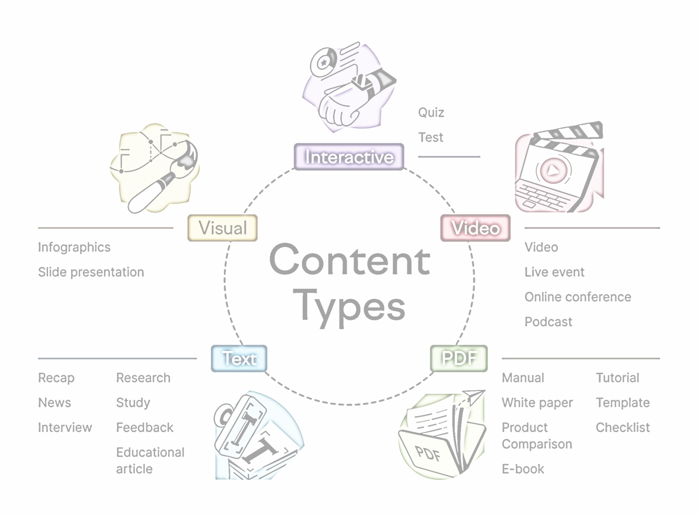

Udemy Course >> Content Creation with ChatGPT AI Automation One-Click Magic

How to Create Content with ChatGPT AI-powered Tool and ChatGPT API Automation with Python for Marketing | How to Automate Content Creation for Blogs + YouTube + Instagram + Facebook + LinkedIn

This course comprehensively explore the use of ChatGPT AI-powered tool for content creation, covering topics such as generating high-quality written content, optimizing content for various platforms, and enhancing content strategy with AI. Real-world applications for students gain practical skills in leveraging AI for content creation in professional contexts.

**********

Topics:
- What is Content Creation and Content Marketing
- Why Content Creation and Content Marketing
- Sections of Your Content
- Content for Platforms and Your Target Audience
- About ChatGPT
- How to Create Content with ChatGPT
- About ChatGPT API and Automation
- Installing Prerequisites for ChatGPT Content Creation Automation on Windows
- ChatGPT Content Creation Automation with Python - One-Click Magic
- ChatGPT Content Creation Automation on Linux - Installing Prerequisites


**********

Tips/Tricks/Notes/Commands URL Link: 
https://github.com/nimaxnimax/Udemy_Content_Creation_ChatGPT_AI_Automation

Instructor & Courses >> 
https://www.udemy.com/user/adrian-fischer-infotech/


**********


What is Content Creation and Content Marketing

Content creation and content marketing are two closely related concepts that play key roles in digital marketing strategies.

1. **Content Creation:**
   - **Definition:** Content creation refers to the process of generating, developing, and producing relevant and valuable information or media for a specific target audience.
   - **Types of Content:** This can include a wide range of formats such as blog posts, articles, videos, infographics, podcasts, social media posts, and more.
   - **Purpose:** The primary goal of content creation is to engage and provide value to the audience, whether it's by educating, entertaining, or solving a problem.

2. **Content Marketing:**
   - **Definition:** Content marketing is a strategic marketing approach that involves creating and distributing valuable, relevant, and consistent content to attract and retain a clearly defined audience.
   - **Strategy:** Rather than explicitly promoting a product or service, content marketing aims to build a relationship with the audience by providing useful and interesting information.
   - **Channels:** Content marketing is implemented through various channels, including a company's website, blog, social media platforms, email newsletters, and more.
   - **Goals:** The ultimate goals of content marketing are often to increase brand awareness, drive customer engagement, establish authority in a particular industry, and ultimately drive profitable customer action.

**Key Points:**
- **Integration:** Content creation is an integral part of content marketing. Without high-quality, relevant content, a content marketing strategy would lack substance.
- **Consistency:** Both content creation and content marketing require a consistent and ongoing effort. Regularly producing and sharing valuable content helps maintain audience interest and trust.
- **Customer-Centric:** Both concepts are centered around understanding and meeting the needs of the target audience. By creating content that resonates with the audience, companies can build stronger relationships and loyalty.

Content creation is the process of producing various types of content, while content marketing is the strategic use of that content to achieve marketing goals. They work hand in hand to establish a brand's presence, engage the audience, and drive desired actions.


**********

Why Content Creation and Content Marketing

Content creation and content marketing are crucial components of a comprehensive digital marketing strategy. Here are several reasons why they are essential:

1. **Audience Engagement:**
   - **Content Creation:** Producing valuable and relevant content allows businesses to connect with their target audience. It provides an opportunity to share information, tell stories, and engage users.
   - **Content Marketing:** By strategically distributing this content through various channels, companies can consistently engage their audience, keeping them interested and involved with the brand.

2. **Brand Visibility and Awareness:**
   - **Content Creation:** Creating content helps increase a brand's visibility in search engines and across different online platforms.
   - **Content Marketing:** Distributing content through channels like social media, email newsletters, and blogs enhances brand awareness. Consistent visibility helps build recognition and trust among the audience.

3. **Establishing Authority and Expertise:**
   - **Content Creation:** Developing high-quality, informative content establishes a brand as an authority in its industry. It showcases expertise and builds credibility.
   - **Content Marketing:** Sharing this content strategically positions the brand as a thought leader. Over time, this can lead to increased trust and loyalty from the audience.

4. **Lead Generation:**
   - **Content Creation:** Content, especially in the form of guides, ebooks, or webinars, can serve as valuable lead magnets, attracting potential customers.
   - **Content Marketing:** By promoting these resources effectively, businesses can capture leads and nurture them through the sales funnel.

5. **Search Engine Optimization (SEO):**
   - **Content Creation:** Search engines favor fresh, relevant content. Regularly updating a website with new content improves its search engine ranking.
   - **Content Marketing:** Sharing content on various platforms and earning backlinks enhances SEO efforts, driving organic traffic to the website.

6. **Building Relationships:**
   - **Content Creation:** Well-crafted content speaks directly to the needs and interests of the audience, fostering a sense of connection.
   - **Content Marketing:** Engaging with the audience through comments, shares, and discussions builds a community around the brand, strengthening relationships.

7. **Conversion and Sales:**
   - **Content Creation:** Content can educate potential customers about products or services, addressing their concerns and facilitating the decision-making process.
   - **Content Marketing:** By strategically guiding prospects through the buyer's journey with relevant content, businesses can increase the likelihood of conversions and sales.

Content creation and content marketing work together to attract, engage, and convert potential customers. They are essential tools for modern businesses looking to thrive in the digital landscape by creating meaningful connections with their audience.


**********



Sections of Your Content

The optimal word count and structure for content can vary depending on the platform, audience, and the specific goals of your content. However, I can provide you with some general guidelines for common types of content:

1. **Blog Posts:**
   - **Introduction:** 100-200 words
   - **Body:** 600-2,000 words (depending on the depth and complexity of the topic)
   - **Conclusion:** 100-200 words

2. **Articles:**
   - **Introduction:** 150-300 words
   - **Body:** 800-2,500 words (again, this can vary based on the topic)
   - **Conclusion:** 150-300 words

3. **Social Media Posts:**
   - **Facebook:** 40-80 characters for a concise message; up to 280 characters for longer posts
   - **Twitter:** 280 characters (but shorter tweets often perform better)
   - **Instagram:** 125 characters for captions (although longer captions with engaging content can work well)
   - **LinkedIn:** 50-100 words for updates; longer for articles or posts with rich content

4. **Email Newsletters:**
   - **Subject Line:** 40-60 characters
   - **Introduction/Preview:** 50-100 words
   - **Body:** 500-1,000 words (can vary based on the purpose of the email)
   - **Call to Action (CTA):** 50-100 words

These are general guidelines, and the most important aspect is to provide valuable, relevant content that resonates with your audience. Additionally, platforms and algorithms change, so it's crucial to monitor the performance of your content and adjust your strategy accordingly. Always prioritize clarity, conciseness, and engaging writing. Tailor your content length to your audience's preferences and the platform's requirements, and don't forget to test and iterate based on the performance of your content.

Titles, tags, and hashtags are important elements for optimizing your content for search engines and social media visibility. Here are some guidelines for each:

Titles:
- **Blog Posts/Articles:**
  - Length: 60-70 characters (for search engine optimization, or SEO)
  - Should be compelling, relevant, and include the main keyword.

Tags:
- **Blog Posts/Articles:**
  - Use relevant tags that represent the main topics or themes of your content.
  - Include both broad and specific tags to maximize discoverability.
  - Be consistent in your use of tags across your content.

Hashtags:
- **Social Media:**
  - **Twitter:** 1-2 hashtags per tweet; use specific and trending hashtags.
  - **Instagram:** 5-10 hashtags per post; mix popular and niche hashtags.
  - **Facebook:** 1-2 hashtags per post; be cautious as Facebook doesn't rely heavily on hashtags.
  - **LinkedIn:** 3-5 hashtags per post; focus on industry-relevant hashtags.

Additional Tips:
- **Research:** Use tools to research and find trending or relevant hashtags.
- **Brand-specific:** Consider creating and using unique hashtags associated with your brand.
- **Consistency:** Use the same hashtags across different posts to build a consistent brand presence.
- **Avoid Overuse:** Don't overload your content with hashtags; it can make it look spammy.

Remember that the effectiveness of titles, tags, and hashtags can vary based on your target audience and the specific platform. Regularly monitor the performance of your content, and adjust your approach based on analytics and audience engagement. Always aim for a balance between optimization and providing value to your audience.


**********


Content for Platforms and Your Target Audience

Creating content that resonates with your target audience on different platforms is crucial for a successful digital marketing strategy. Here are some considerations for tailoring your content to specific platforms and audiences:

1. **Understand Your Audience:**
   - **Demographics:** Know the age, gender, location, and interests of your target audience.
   - **Preferences:** Understand how your audience consumes content and their preferred platforms.

2. **Platform-Specific Content:**
   - **Facebook:**
     - **Content Type:** Varied content like articles, videos, and images.
     - **Engagement:** Focus on creating shareable content to increase reach.

   - **Instagram:**
     - **Content Type:** Visually appealing images and videos.
     - **Storytelling:** Leverage Instagram Stories for behind-the-scenes and real-time updates.

   - **Twitter:**
     - **Content Type:** Short, concise updates; use trending hashtags.
     - **Engagement:** Actively participate in conversations and retweet relevant content.

   - **LinkedIn:**
     - **Content Type:** Professional and educational content.
     - **Thought Leadership:** Share industry insights, case studies, and articles.

   - **YouTube:**
     - **Content Type:** In-depth videos, tutorials, and vlogs.
     - **Consistency:** Regularly publish and optimize videos for search.

3. **Adapt Your Tone and Style:**
   - **Formality:** Adjust the tone based on the platform's culture (e.g., casual on Twitter, professional on LinkedIn).
   - **Language:** Tailor the language to match the preferences of your audience.

4. **Timing Matters:**
   - **Peak Times:** Post when your audience is most active on each platform.
   - **Consistency:** Establish a posting schedule to maintain audience engagement.

5. **Visual Appeal:**
   - **Quality:** Use high-quality visuals that align with the platform's standards.
   - **Consistency:** Maintain a consistent visual theme for brand recognition.

6. **Interactive Content:**
   - **Polls and Surveys:** Encourage audience participation.
   - **Q&A Sessions:** Host live sessions for real-time engagement.

7. **Analytics and Iteration:**
   - **Track Performance:** Use analytics tools to measure the success of your content.
   - **Adaptation:** Modify your strategy based on what works best for your audience.

8. **Localization:**
   - **Language and Culture:** Consider local languages and cultural nuances when targeting specific regions.

9. **Cross-Promotion:**
   - **Integrate:** Share content across platforms for cross-promotion.
   - **Consistent Branding:** Maintain consistent branding elements.

10. **Feedback and Engagement:**
   - **Respond:** Engage with your audience through comments, messages, and mentions.
   - **Feedback Loop:** Use feedback to refine your content strategy.

Tailoring your content to the unique characteristics of each platform and understanding your audience's preferences will enhance the effectiveness of your digital marketing efforts. Regularly evaluate and adapt your strategy to stay aligned with changing trends and audience behaviors.

Target audience refers to the specific group of people that a content creator or marketer aims to reach with their messages. Here are 20 examples of target audiences in content creation or marketing:

1. **Tech Enthusiasts:** Individuals passionate about the latest technological advancements and gadgets.
2. **Parents of Young Children:** Content tailored for parents with infants or toddlers.
3. **Fitness Fanatics:** People dedicated to maintaining a healthy and active lifestyle.
4. **Foodies:** Individuals who love exploring and trying new foods and recipes.
5. **Small Business Owners:** Content designed to assist entrepreneurs in managing and growing their businesses.
6. **Book Lovers:** Readers who are interested in literature, book reviews, and related content.
7. **Travel Enthusiasts:** Those who enjoy exploring new destinations and seeking travel-related information.
8. **Fashionistas:** Individuals with a keen interest in the latest fashion trends and styles.
9. **Gamers:** Content catering to the gaming community, including reviews, tips, and updates.
10. **Young Professionals:** Targeting individuals in the early stages of their careers.
11. **Pet Owners:** Content focused on the care, health, and well-being of pets.
12. **Green Living Advocates:** People interested in sustainable and eco-friendly lifestyle choices.
13. **DIY and Crafters:** Individuals who enjoy do-it-yourself projects and crafting activities.
14. **Financial Investors:** Content tailored for those interested in personal finance, investments, and wealth management.
15. **Health and Wellness Seekers:** Targeting individuals looking for ways to improve their overall well-being.
16. **Students:** Content created to support and engage with students in various academic fields.
17. **Seniors:** Tailoring content for an older demographic, addressing their specific needs and interests.
18. **Social Activists:** Individuals passionate about social and environmental causes.
19. **Freelancers:** Content focused on the challenges and opportunities faced by freelancers in various industries.
20. **Art and Creativity Enthusiasts:** Targeting individuals with an interest in visual arts, music, and other creative pursuits.

These are just examples, and in reality, target audiences can be even more specific based on the goals and nature of the content or marketing campaign.


**********

About ChatGPT

ChatGPT is a language model developed by OpenAI, based on the GPT (Generative Pre-trained Transformer) architecture. It is designed to understand and generate human-like text based on the input it receives.

Key features and information about ChatGPT include:

1. **Training Data:** ChatGPT has been trained on a diverse range of internet text to develop a broad understanding of language. It doesn't have access to specific sources or databases, and its responses are generated based on patterns learned during training.

2. **Generative Nature:** ChatGPT is a generative model, meaning it can generate coherent and contextually relevant text based on the prompts it receives. It doesn't retrieve pre-existing information but generates responses on the fly.

3. **Usage:** ChatGPT can be used for a variety of natural language processing tasks, including answering questions, creating conversational agents, generating content, and more. It's a versatile tool for understanding and producing text in a human-like manner.

4. **Limitations:** While powerful, ChatGPT has limitations. It may generate incorrect or nonsensical answers, be sensitive to input phrasing, and might exhibit biased behavior or respond to harmful instructions. OpenAI has implemented safety mitigations and moderation to address potential issues.

5. **Fine-Tuning:** OpenAI has introduced a fine-tuning capability for ChatGPT. This allows users to customize the model's behavior for specific applications. Fine-tuned models are subject to guidelines and ethical use policies.

6. **Conversation History:** ChatGPT can maintain context over a conversation, remembering the information provided earlier in the chat. However, there is a token limit, and long conversations may result in older parts being forgotten.

7. **Safety and Ethical Use:** OpenAI places a strong emphasis on safety. They use reinforcement learning from human feedback (RLHF) and the Moderation API to mitigate unsafe and inappropriate outputs. Users are encouraged to provide feedback on problematic model outputs through the user interface.

It's important to note that ChatGPT is a tool that should be used responsibly and ethically. OpenAI provides usage guidelines, and users are encouraged to be mindful of the model's capabilities and limitations. As of my last knowledge update in January 2022, OpenAI may have made updates or improvements to ChatGPT, so I recommend checking the official OpenAI website for the latest information.


**********

How to Create Content with ChatGPT

Creating content with ChatGPT involves providing a prompt or input to the model and then generating text based on that input. Here are the steps to create content using ChatGPT:

1. **Access the OpenAI API or Playground:**
   - You can use the OpenAI API if you have access to it, or you can experiment with ChatGPT on the OpenAI Playground (https://platform.openai.com/playground).

2. **Craft Your Prompt:**
   - Begin by formulating a clear and specific prompt or question. The prompt should clearly convey the type of information or response you're looking for. Be explicit in your instructions.

3. **Specify the Format:**
   - If you have a specific format in mind for the response (e.g., a paragraph, a list, a story), you can include instructions to guide the model in generating content in that format.

4. **Experiment and Iterate:**
   - Don't hesitate to experiment with different prompts, instructions, and parameters. You may need to iterate to get the output that aligns best with your expectations.

5. **Provide Context:**
   - If your content creation involves a conversation, you can use the system's ability to maintain context. Refer back to previous messages in the conversation to provide context for the model.

6. **Review and Edit:**
   - The initial output from ChatGPT is generated in real-time. Review the output carefully, and feel free to edit or refine it as needed. You can guide the model with additional prompts or clarify instructions if necessary.

7. **Fine-Tuning (Optional):**
   - If you have access to fine-tuning capabilities, you can fine-tune ChatGPT on custom datasets to tailor its behavior to specific use cases. Follow the guidelines provided by OpenAI for fine-tuning.

8. **Provide Feedback:**
   - If you encounter issues with the model's output or behavior, consider providing feedback through the OpenAI user interface. This helps OpenAI improve the system and address potential shortcomings.

Remember that ChatGPT is a powerful tool, but it has limitations. It's important to use it in a way that aligns with ethical standards and to be aware of potential biases or inaccuracies in the generated content.


**********

About ChatGPT API and Automation

OpenAI had introduced the ChatGPT API, allowing developers to integrate ChatGPT into their own applications, products, or services. The API enables automation and programmatic interaction with ChatGPT, providing a way to leverage the model's capabilities in various contexts.

Here are key points about ChatGPT API and automation:

1. **Access and Documentation:**
   - Developers can access the ChatGPT API by signing up on the OpenAI platform. Documentation, including API reference and usage guidelines, is typically provided to help developers integrate the API effectively.

2. **Token Usage and Cost:**
   - The ChatGPT API operates on a token-based system, where both input and output tokens contribute to the cost. Developers need to manage and track token usage to control costs.

3. **Integration and Use Cases:**
   - The API can be integrated into a wide range of applications, such as chatbots, content generation tools, customer support systems, and more. Its flexibility allows developers to tailor the interaction based on specific use cases.

4. **Fine-Tuning:**
   - Developers may have the option to fine-tune ChatGPT on custom datasets to make it more suitable for specific tasks or industries. Fine-tuning is typically done in accordance with OpenAI's guidelines and ethical considerations.

5. **Rate Limits and Quotas:**
   - OpenAI imposes rate limits and usage quotas for the ChatGPT API to ensure fair usage and system stability. Developers need to be aware of these limits and design their applications accordingly.

6. **Security and Authorization:**
   - The API access involves secure authentication and authorization mechanisms to protect user data and maintain the integrity of interactions. Developers should follow best practices for securing API access.

7. **Automation and Scalability:**
   - The API allows for automation of tasks that involve natural language understanding and generation. Developers can scale their applications by integrating ChatGPT API to handle various user inputs and generate responses dynamically.

8. **Feedback Loop:**
   - OpenAI encourages developers to provide feedback on problematic model outputs and issues encountered while using the API. This helps improve the system and address any shortcomings.

For the latest information, guidelines, and updates regarding the ChatGPT API, I recommend checking the official OpenAI website and documentation.


**********

Installing Prerequisites for ChatGPT Content Creation Automation on Windows

To install Python on Windows, you can follow these steps:

1. **Download Python Installer:**
   - Visit the official Python website: [https://www.python.org/](https://www.python.org/).
   - Navigate to the "Downloads" section.
   - Click on the "View the full list of downloads" link.
   - Choose the latest version of Python for Windows. As of my last update, Python 3.x is the latest stable version.

2. **Download Python Installer:**
   - Scroll down to the files section and find the installer for Windows. Choose the one labeled "Windows Installer" (not the "Windows x86-64 executable installer" unless you are specifically using a 64-bit system).
   - Click on the installer to download it.

3. **Run the Installer:**
   - Once the installer is downloaded, locate the file (it's usually in your Downloads folder) and run it by double-clicking on it.
   - The installer will open. Make sure to check the box that says "Add Python to PATH" during installation. This makes it easier to run Python from the command line.

4. **Install Python:**
   - Click on the "Install Now" button to start the installation process. The installer will copy the necessary files to your computer.

5. **Verify Installation:**
   - Open a command prompt or PowerShell window.
   - Type `python --version` or `python -V` and press Enter. This should display the installed Python version.

6. **Install a Code Editor (Optional):**
   - While not strictly necessary, you might find it helpful to install a code editor for writing and running your Python scripts. Popular choices include Visual Studio Code, PyCharm, or IDLE (which is included with Python).

Now, Python is installed on your Windows system. You can use it for running Python scripts, including those related to ChatGPT content creation automation. Remember to install any additional Python packages or libraries your automation scripts may require using the `pip` package manager. For example:

```bash
pip install openai
```

This command installs the OpenAI Python package, which you may use for interacting with the ChatGPT API. Adapt the libraries based on your specific needs for content creation automation.


**********

ChatGPT Content Creation Automation with Python - One-Click Magic

1. **Obtain Your API Key:**
   - Go to the OpenAI platform and obtain your API key. If you don't have one, you'll need to sign up and get access to the API.

2. **Update `chatgpt_api_key.txt`:**
   - Open the `chatgpt_api_key.txt` file using a text editor.
   - Replace the existing content with your API key.
   - Save and close the file.

3. **Run the Automation Script:**
   - Execute the `chatgpt_automation.pyc` script. You can do this by running the following command in the terminal or command prompt:
     ```bash
     python chatgpt_automation.pyc
     ```
     If you are using Python 3, use `python3` instead:
     ```bash
     python3 chatgpt_automation.pyc
     ```

   - The script should now run with your updated API key.


**********

ChatGPT Content Creation Automation on Linux - Installing Prerequisites

On Ubuntu 20.04 or 22.04, Python is often pre-installed. However, you might want to install a specific version or ensure that you have the latest one. Here are the steps to install Python on Ubuntu:

For Python 3:

1. **Update Package List:**
   ```bash
   sudo apt update
   ```

2. **Install Python 3:**
   ```bash
   sudo apt install python3
   ```

3. **Verify Installation:**
   ```bash
   python3 --version
   ```

   This should display the installed Python 3 version.

For pip (Python Package Installer):

1. **Install pip:**
   ```bash
   sudo apt install python3-pip
   ```

2. **Verify pip Installation:**
   ```bash
   pip3 --version
   ```

   This should show the installed pip version.

Virtual Environment (Optional, but recommended):

Using a virtual environment is a good practice to isolate your Python projects and dependencies.

1. **Install Virtualenv:**
   ```bash
   sudo apt install python3-venv
   ```

2. **Create a Virtual Environment:**
   ```bash
   python3 -m venv venv
   ```

   This command creates a virtual environment named "venv."

3. **Activate the Virtual Environment:**
   ```bash
   source venv/bin/activate
   ```

   Your command prompt should now show the virtual environment name.

   To deactivate the virtual environment when you're done, simply run:
   ```bash
   deactivate
   ```

These steps should get you set up with Python on Ubuntu. You can then use this Python environment for your ChatGPT content creation automation. If you're working with the OpenAI GPT-3 API, you might also need to install the OpenAI Python library:

```bash
pip install openai
```

Remember to replace `python` and `pip` with `python3` and `pip3` if you are using Python 3, as is common on Ubuntu. Adjust the Python version and package names based on your specific requirements and the Python version you prefer to use.


**********

Tips/Tricks/Notes/Commands URL Link: 
https://github.com/nimaxnimax/Udemy_Content_Creation_ChatGPT_AI_Automation

Instructor & Courses >> 
https://www.udemy.com/user/adrian-fischer-infotech/

What You Learn in This Udemy Course
- Content Creation with ChatGPT AI Automation One-Click Magic
- How to Create Content with ChatGPT AI-powered Tool and ChatGPT API Automation with Python for Marketing
- How to Automate Content Creation for Blogs + YouTube + Instagram + Facebook + LinkedIn
- Generating High-quality Written Content
- Optimizing Content for Various Platforms
- Real-world Applications - AI for Content Creation in Professional Contexts
- What is Content Creation and Content Marketing
- Why Content Creation and Content Marketing
- Sections of Your Content
- Content for Platforms and Your Target Audience
- About ChatGPT
- How to Create Content with ChatGPT
- About ChatGPT API and Automation
- Installing Prerequisites for ChatGPT Content Creation Automation on Windows
- ChatGPT Content Creation Automation with Python - One-Click Magic
- ChatGPT Content Creation Automation on Linux - Installing Prerequisites

Who This Course is for?!
1. **Content Creators:**
   - Writers, bloggers, and journalists looking to enhance their content creation skills.
   - Video creators and vloggers interested in incorporating ChatGPT into their scripts or narratives.
2. **Marketers:**
   - Digital marketers aiming to explore innovative ways to engage their audience through AI-generated content.
   - Social media marketers interested in optimizing their content strategy with ChatGPT.
3. **Business Owners and Entrepreneurs:**
   - Small business owners seeking cost-effective and efficient content creation solutions.
   - Entrepreneurs looking to implement content marketing strategies for their startups.
4. **SEO Professionals:**
   - SEO specialists wanting to understand how AI-generated content can contribute to search engine optimization.
5. **Students and Educators:**
   - Students studying marketing, communications, or related fields.
   - Educators looking to incorporate cutting-edge technologies into their curriculum.
6. **AI Enthusiasts:**
   - Individuals interested in learning about the capabilities of AI, specifically in content creation and marketing.
7. **Freelancers:**
   - Freelancers in the content creation or marketing industry looking to expand their skill set.
8. **Communication Professionals:**
   - PR professionals interested in creating compelling narratives using AI-generated content.
   - Communication specialists aiming to explore new avenues for engaging with their audience.
9. **Anyone Interested in Content Marketing Trends:**
   - Individuals curious about the latest trends in content marketing and AI applications.
10. **Technical Writers and Documentation Professionals:**
    - Technical writers exploring innovative methods to enhance their documentation with AI-generated content.
11. **Product Managers:**
    - Those responsible for promoting and explaining products or services, looking to enhance product messaging and communication.
12. **Nonprofit Organizations:**
    - Individuals working in the nonprofit sector seeking effective ways to communicate their mission and engage their audience.
13. **UX/UI Designers:**
    - Design professionals interested in creating user-centric content and incorporating AI-generated elements into user interfaces.
14. **Job Seekers:**
    - Individuals looking to improve their personal brand through enhanced content creation skills for online portfolios, resumes, or LinkedIn profiles.
15. **Language Enthusiasts:**
    - People passionate about language and linguistics, interested in exploring the creative potential of AI-generated content.
16. **Data Scientists and AI Developers:**
    - Professionals in the field of artificial intelligence exploring practical applications of language models in content creation and marketing.
17. **E-commerce Professionals:**
    - Online store owners or e-commerce professionals looking to optimize product descriptions and marketing content.
18. **Public Speakers:**
    - Those who engage in public speaking wanting to incorporate AI-generated content for more engaging presentations.
19. **Podcasters:**
    - Podcast creators interested in using AI-generated content to enhance their scripts or introduce innovative segments.
20. **Government Communicators:**
    - Professionals working in government or public affairs seeking new approaches to communicate policies and initiatives effectively.
21. **Event Planners:**
    - Individuals involved in event planning looking to create engaging content for promotional purposes.
22. **Healthcare Professionals:**
    - Healthcare communicators aiming to develop informative and engaging content for patients and the general public.
23. **International Businesses:**
    - Professionals in global enterprises interested in creating culturally relevant and localized content.
24. **Creatives and Artists:**
    - Visual artists, musicians, and other creatives looking to explore collaborations between AI-generated and human-generated content.
25. **Innovators and Early Adopters:**
    - Individuals who are generally interested in staying ahead of the curve and exploring emerging technologies for creative purposes.
